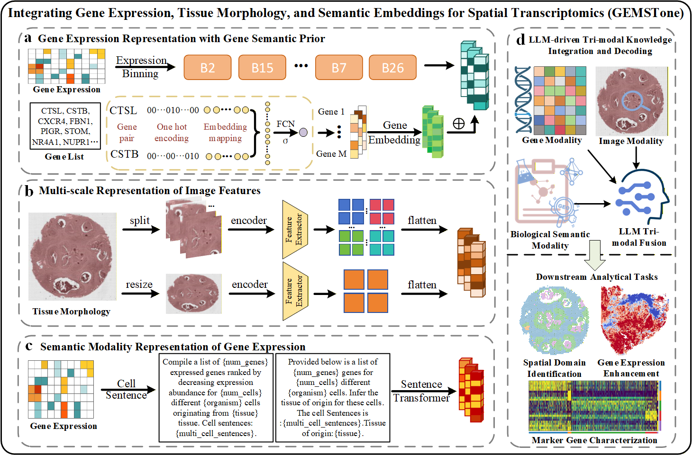

# GEMSTone

**GEMSTone: Language Model–Enabled Semantic Representation Learning of Gene Expression and Morphology for Spatial Transcriptomics**

---
## Framework



---

## Abstract

Artificial intelligence has emerged as a pivotal methodological advance in analyzing spatial transcriptomics. However, existing computational approaches either adopt simplistic strategies for integrating gene expression and tissue morphology, or neglect the auxiliary metadata embedded in transcriptomic observations, thereby limiting both modeling capacity and interpretability. GEMSTone, a generalizable large language model–based framework, is introduced to learn unified semantic representations of gene expression and morphology in spatial transcriptomics. The framework enhances transcriptomic modeling by incorporating gene-aware embeddings as structured priors derived from gene co-expression patterns, preserving biologically meaningful gene–gene relationships. Multi-scale morphological features are extracted from histological images to capture local and global structural characteristics. Gene expression profiles are transformed into cell-level gene sentences and augmented with metadata such as tissue type and organism, and are encoded using a sentence-level Transformer to obtain semantic embeddings. These transcriptomic, morphological, and semantic representations are jointly integrated to produce enriched and interpretable cell representations. The framework demonstrates superior performance across multiple spatial transcriptomics datasets, including human breast and colorectal cancer samples, achieving improvements in adjusted Rand index (ARI), accuracy, and macro-F1 score. GEMSTone provides a biologically grounded and semantically enriched framework for multimodal spatial transcriptomics analysis.

---

## Project Structure
```bash
.
├── cell2sentence/ # Convert gene expression to gene sentences
├── performer_pytorch/ # Performer / Transformer implementation
├── 1.0finetune_raw.py # Raw data finetuning
├── 1.1finetune_spatial_sen.py # Semantic-aware and spatial finetuning
├── 2.0predict.py # Main prediction script
├── 2.1predict_raw.py # Raw prediction script
├── utils.py # Utility functions
├── gene2vec_16906.npy # Gene embedding
├── panglao_pretrain.pth # Pretrained weights
├── method2.png # Framework illustration
├── README.md
└── LICENSE
```
---

## Method Pipeline

1. **Gene Expression Encoding**
   - Embed gene expression with Gene2Vec
   - Preserve biological relationships

2. **Morphological Feature Extraction**
   - Extract patch-level image features
   - Capture multi-scale spatial structure

3. **Semantic Construction**
   - Convert expression to gene sentences
   - Add metadata (e.g., tissue, organism)

4. **Transformer Encoding**
   - Encode gene sentences via Performer/Transformer

5. **Multimodal Fusion**
   - Integrate expression, morphology, and semantics
   - Generate unified cell representations

---

## Requirements

```bash
Python >= 3.10
torch == 2.1.2
torchvision == 0.16.2
transformers == 4.46.3
timm == 1.0.11
scanpy == 1.11.5
anndata == 0.10.9
h5py == 3.12.1
gseapy == 1.1.11
numpy == 1.26.3
pandas == 2.2.3
scipy == 1.14.1
scikit-learn == 1.5.2
sentence-transformers == 3.3.1
tokenizers == 0.20.3
sentencepiece == 0.2.0
huggingface-hub == 0.27.1
```
---

## 安装与配置
```bash
# 1. 克隆仓库
git clone [https://github.com/lengjk1214/GEMSTone.git](https://github.com/lengjk1214/GEMSTone.git)
cd GEMSTone

# 2. 创建并激活 Conda 环境
conda create -n gemstone python=3.10 -y
conda activate gemstone

```